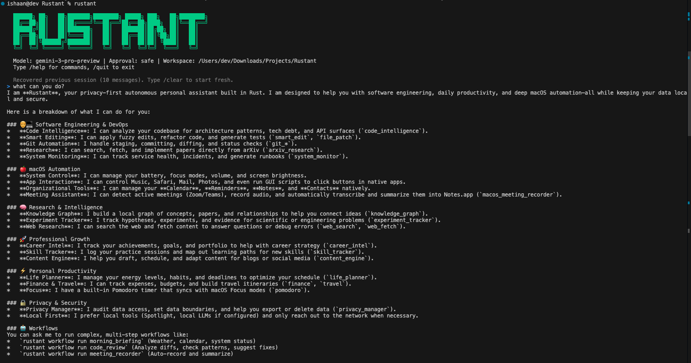

<p align="center">
  
</p>

<p align="center">
  <a href="https://github.com/DevJadhav/Rustant/actions/workflows/ci.yml"></a>
  <a href="https://crates.io/crates/rustant"></a>
  <a href="LICENSE"></a>
  <a href="https://www.rust-lang.org"></a>
  <a href="CHANGELOG.md"></a>
</p>

<p align="center">A high-performance, privacy-first autonomous personal agent built entirely in Rust.</p>

**Rust** + **Assistant** = **Rustant** — like an industrious ant, small but capable of carrying workloads many times its size.

<p align="center">
  
</p>

## Overview

Rustant is an LLM-powered agent that executes complex tasks through a Think-Act-Observe (ReAct) loop while maintaining strict safety guarantees. It supports voice commands, browser automation, 13 messaging channels, multi-agent orchestration, security scanning, ML engineering, and extensible plugins — all running locally with optional cloud features.

### Core Differentiators

- **Transparent Autonomy** — Every tool call, safety denial, and contract violation produces a reviewable `DecisionExplanation`, logged via Merkle-chain audit trail
- **Progressive Control** — From "suggest only" to "full autonomy with audit" across four approval modes plus 5-level progressive trust
- **Adaptive Context Engineering** — Three-tier memory with smart compression, message pinning, and cross-session learning via facts and corrections
- **Git-Native Safety** — All file operations are reversible through automatic checkpointing
- **Zero-Cloud Option** — Complete functionality with local LLMs (Ollama, vLLM) — no data leaves your machine
- **Rust Performance** — Sub-millisecond tool dispatch, minimal memory footprint
- **Platform Agnostic** — 13 messaging channels, MCP protocol for tool interoperability

## Quick Start

```bash
# Cargo (from crates.io)
cargo install rustant

# Pre-built binary (faster, no compilation)
cargo binstall rustant

# Homebrew (macOS/Linux)
brew install DevJadhav/rustant/rustant

# Shell installer (Linux/macOS)
curl -fsSL https://raw.githubusercontent.com/DevJadhav/Rustant/main/scripts/install.sh | bash
```

**Security-first credentials** — Rustant stores API keys in your OS keychain, never as plaintext environment variables:

```bash
rustant setup              # Interactive wizard → stores key in OS keychain
```

```bash
# Interactive REPL
rustant

# Single task
rustant "refactor the auth module"

# With options
rustant --model gpt-4o --approval cautious --workspace ./project "add tests for the API"
```

## Architecture

```
rustant/
├── rustant-core/      # Agent orchestrator, brain, memory, safety, channels, gateway
├── rustant-tools/     # 73 built-in tools (45 base + 3 iMessage + 25 macOS native)
├── rustant-cli/       # CLI with REPL and slash commands
├── rustant-mcp/       # MCP server + client (JSON-RPC 2.0)
├── rustant-plugins/   # Plugin system (native + WASM)
├── rustant-security/  # Security scanning, code review, compliance (33 tools)
├── rustant-ml/        # ML/AI engineering, training, evaluation (54 tools)
└── rustant-ui/        # Tauri desktop dashboard
```

**160 tools** across 8 crates: 73 base (macOS) + 33 security + 54 ML. **117 slash commands.** **38 workflow templates.**

| Component | Description |
|-----------|-------------|
| **Brain** | 6 LLM providers (OpenAI, Anthropic, Gemini, Azure, Ollama, vLLM) with failover, prompt caching, retry |
| **Memory** | Three-tier (working/short-term/long-term) with pinning, compression, cross-session learning |
| **Safety** | 5-layer defense, 4 approval modes, progressive trust (5 levels), global circuit breaker, policy engine |
| **Tools** | Dynamic registry with JSON schema validation, timeouts, risk levels, auto-routing |
| **Channels** | 13 platform integrations with CDC, auto-reply, digest, style learning |
| **Security Engine** | SAST, SCA, secrets scanning, container/IAC analysis, compliance, incident response |
| **ML Engine** | Data pipelines, training, model zoo, LLM fine-tuning, RAG, evaluation, inference, research |
| **Workflows** | 38 templates with approval gates, cron scheduling, automatic task routing |

## Features

### LLM Providers

OpenAI, Anthropic, Google Gemini, Azure OpenAI, Ollama (local), and vLLM (self-hosted). All providers support failover circuit breaker, prompt caching (Anthropic/OpenAI/Gemini), and automatic retry with exponential backoff.

**LLM Council** — Multi-model deliberation for planning tasks: parallel query, anonymous peer review, chairman synthesis.

### Tools at a Glance

| Category | Count | Examples |
|----------|-------|---------|
| Core | 17 | file_read/write/patch, git_status/diff/commit, shell_exec, smart_edit, codebase_search |
| Productivity | 11 | organizer, pomodoro, inbox, finance, flashcards, travel, pdf, template |
| Research | 1 | arxiv_research (22 actions: search, summarize, citation graph, paper-to-code) |
| Cognitive | 10 | knowledge_graph, experiment_tracker, code_intelligence, content_engine, system_monitor |
| macOS Native | 25 | calendar, reminders, notes, mail, music, contacts, safari, gui_scripting, accessibility, OCR, homekit, siri |
| iMessage | 3 | send, read, search |
| SRE/DevOps | 5 | alert_manager, deployment_intel, prometheus, kubernetes, oncall |
| Fullstack | 5 | scaffold, dev_server, database, test_runner, lint |
| Security | 33 | SAST, SCA, secrets, container, IAC, compliance, incident response, code review |
| ML/AI | 54 | data pipelines, training, model zoo, LLM ops, RAG, evaluation, inference, research |

### Safety Model

Four approval modes (Safe, Cautious, Paranoid, Yolo) plus progressive trust (Shadow → DryRun → Assisted → Supervised → SelectiveAutonomy). Global circuit breaker with sliding-window failure detection. Policy engine with `.rustant/policies.toml`. Prompt injection detection, git checkpointing, Merkle audit trail, WASM/filesystem sandboxing.

### Messaging & Intelligence

13 channels (Slack, Discord, Telegram, Email, Matrix, Signal, WhatsApp, SMS, IRC, Teams, iMessage, WebChat, Webhook) with two-tier message classification, auto-reply, periodic digests, smart scheduling, and per-sender communication style learning.

### More Capabilities

- **Voice** — STT (Whisper) + TTS (OpenAI) + wake word detection
- **Browser** — Chrome DevTools Protocol automation + MCP integration
- **Canvas** — Charts, tables, forms, Mermaid diagrams, code rendering
- **Personas** — 8 adaptive personas (Architect, SecurityGuardian, MlopsEngineer, etc.) with auto-detect and evolution
- **Plan Mode** — Generate-Review-Execute flow for complex tasks
- **Multi-Agent** — Parent-child spawning, message bus, resource isolation
- **Sessions** — Auto-save, resume, search, tagging, auto-recovery
- **WebSocket Gateway** — Remote access with TLS and REST API
- **Project Templates** — 6 scaffolds (React/Vite, Next.js, FastAPI, Rust/Axum, SvelteKit, Express)

## Development

```bash
cargo build --workspace                # Build all crates
cargo test --workspace                 # All ~2800 tests
cargo fmt --all -- --check             # Format check
cargo clippy --workspace --all-targets -- -D warnings  # Lint
cargo doc --workspace --no-deps --open # API docs
```

**Requirements:** Rust 1.88+, Git configured (`git config --global user.email` / `user.name`)

## Documentation

- **User Guide** — [docs/](docs/) (mdBook)
- **API Reference** — `cargo doc --workspace --no-deps --open`
- **Changelog** — [CHANGELOG.md](CHANGELOG.md)
- **Contributing** — [CONTRIBUTING.md](CONTRIBUTING.md)
- **Security Policy** — [SECURITY.md](SECURITY.md)
- **Code of Conduct** — [CODE_OF_CONDUCT.md](CODE_OF_CONDUCT.md)

## License

[MIT](LICENSE)
